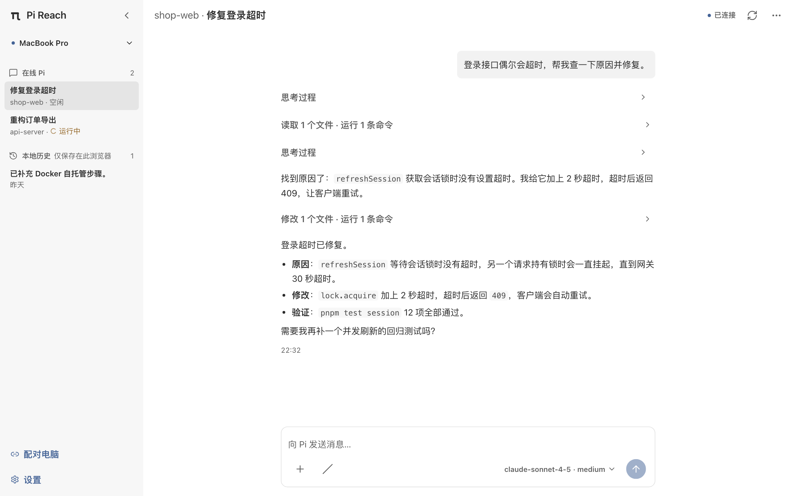
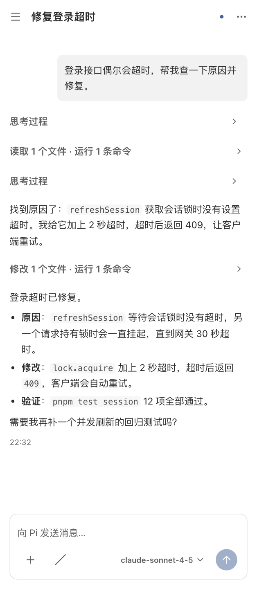

<p align="center">
  
</p>

<h1 align="center">Pi Reach</h1>

<p align="center">在手机或任意浏览器上，远程操作你电脑上正在运行的 <a href="https://github.com/earendil-works/pi">Pi coding agent</a>。</p>

<p align="center">
  <a href="https://github.com/yefengr/pi-reach/actions/workflows/ci.yml"></a>
  <a href="https://www.npmjs.com/package/@yefengr/pi-reach"></a>
  <a href="LICENSE"></a>
</p>

<p align="center"><b>简体中文</b> · <a href="README.en.md">English</a></p>

Pi Reach 为 Pi 加上一个浏览器入口：离开电脑时，用手机扫码配对，就能查看 Pi 的实时输出、继续发送指令、停止任务或切换模型。会话始终在你自己的电脑上执行。

<p align="center">
  
  
</p>

> [!NOTE]
> 项目仍处于早期阶段，协议与本地数据格式可能调整。

## 功能

- **扫码配对，无需账号**：在 Pi 中生成二维码，用手机扫描或输入 8 位配对码即可连接。
- **多台电脑、多个 Pi**：一个浏览器可以配对多台电脑；同一台电脑上同时打开的多个 Pi 都会列出，可随时切换。
- **实时会话**：流式查看回复与工具调用，发送文字和图片（相册、相机或剪贴板），随时停止当前任务。
- **会话操作**：新建会话、压缩上下文、切换模型与思考级别。
- **本地历史**：收到的会话记录保存在浏览器中，离线时也能只读查看。
- **可安装的 PWA**：可添加到主屏幕，支持浅色／深色主题与中英文界面。

## 工作原理

```text
手机 / 浏览器（PWA）  ⇄  Relay  ⇄  你电脑上的 Pi + Pi Reach Extension
```

- **Extension** 随 Pi 启动自动连接 Relay，Pi 退出后随之下线。Pi Reach 不会远程启动或唤醒 Pi。
- **Relay** 只负责在线状态、访问控制和消息转发。它的状态全部在内存中，不保存会话内容。
- **PWA** 是纯静态应用，配对和会话记录只保存在当前浏览器；电脑端的身份与配对保存在本机（`~/.pi/pi-reach` 与系统钥匙串）。没有云账号，也没有云同步。

## 快速开始

先安装 [Pi coding agent](https://github.com/earendil-works/pi)，然后：

1. 安装 Extension：

   ```bash
   pi install npm:@yefengr/pi-reach
   ```

   默认对当前用户的所有项目生效；加 `-l` 则只装到当前项目。

2. 像平时一样启动 Pi。Extension 会自动连接 Relay，默认使用本项目维护者提供的公共 Relay（见[安全模型](#安全模型)）。
3. 在手机或其他设备的浏览器中打开 <https://pi-reach.yefengr.cn/app>，可以把它添加到主屏幕。
4. 在 Pi 中运行下面的命令，然后用 PWA 扫描终端里的二维码，或输入 8 位配对码：

   ```text
   /pi-reach pair
   ```

5. 在 PWA 中选择在线的 Pi，发送第一条消息。

每台电脑只需配对一次。之后这台电脑上加载了 Extension 的 Pi 都会自动出现在 PWA 中。

## 常用命令

| 命令 | 作用 |
| --- | --- |
| `/pi-reach pair` | 显示配对二维码和配对码 |
| `/pi-reach status` | 查看连接与配对状态 |
| `/pi-reach devices` | 列出这台电脑已配对的浏览器 |
| `/pi-reach revoke <shortid>` | 撤销某个浏览器的配对（`shortid` 见 `devices` 输出） |
| `/pi-reach stop`、`/pi-reach start` | 断开或重新连接 Relay |
| `/pi-reach set-relay <url>` | 设置 Relay 地址 |
| `/pi-reach config` | 查看当前使用的 Relay 地址 |

## 配置 Relay

Pi 和 PWA 必须使用同一个 Relay，二维码不携带 Relay 地址。

- **Pi**：依次读取环境变量 `PI_REACH_RELAY`、`/pi-reach set-relay` 保存的地址（`~/.pi/pi-reach/config.json`），都没有时使用默认的公共 Relay。
- **PWA**：在「设置 → 连接 → Relay 地址」中修改。

Relay 地址使用 `https://`（本地调试可用 `http://`），两端会自动转换为对应的 WebSocket 地址。

## 自托管

公共 Relay 和 PWA 由本项目维护者运营，适合试用；处理敏感代码时，建议部署自己的实例。两者由根目录的 `docker-compose.yml` 编排，可以直接使用发布到 GHCR 的镜像（仅 `linux/amd64`）。Relay 与 PWA 的版本号相互独立，分别取 [Releases](https://github.com/yefengr/pi-reach/releases) 中最新的 `relay-vX.Y.Z` 与 `pwa-vX.Y.Z`：

```bash
RELAY_IMAGE=ghcr.io/yefengr/pi-reach-relay:vX.Y.Z \
PWA_IMAGE=ghcr.io/yefengr/pi-reach-pwa:vX.Y.Z \
docker compose up -d
```

镜像附带构建来源证明，可以用 `gh attestation verify oci://ghcr.io/yefengr/pi-reach-pwa:vX.Y.Z --owner yefengr` 核对它由本仓库的发布工作流构建。其他架构（如 arm64）或需要自行修改时，从仓库根目录构建：

```bash
docker build -f relay/Dockerfile -t pi-reach-relay .
docker build -f pwa/Dockerfile -t pi-reach-pwa .
RELAY_IMAGE=pi-reach-relay PWA_IMAGE=pi-reach-pwa docker compose up -d
```

Compose 只监听本机回环地址（Relay 为 `127.0.0.1:3000`，PWA 为 `127.0.0.1:3001`），需要在前面加一层 HTTPS 反向代理，例如 Caddy：

```caddyfile
pwa.example.com {
    reverse_proxy 127.0.0.1:3001
}

relay.example.com {
    reverse_proxy 127.0.0.1:3000
}
```

然后在 Pi 中运行 `/pi-reach set-relay https://relay.example.com`，打开 `https://pwa.example.com/app` 并在设置中填入同一个 Relay 地址，最后重新运行 `/pi-reach pair`。

PWA 必须通过 HTTPS（或同一设备上的 `localhost`）访问，否则浏览器可能禁用它依赖的加密和摄像头接口。Relay 的资源限额见 [Relay 说明](relay/README.md)。

## 安全模型

> [!WARNING]
> Pi Reach 目前没有应用层端到端加密，Relay 是完全受信的一方。

- 传输只由 TLS 保护，消息内容对 Relay 不加密。运营 Relay 的人能看到全部会话内容，包括代码、命令和输出。
- 浏览器的身份也由 Relay 认证，因此运营方还可以冒充已配对的浏览器向你的 Pi 发送指令，而 Pi 能在你的电脑上执行命令。
- 默认的公共 Relay（`pi-reach-relay.yefengr.cn`）由本项目维护者运营。处理敏感代码时，请使用[自托管](#自托管)的 Relay。
- 配对按电脑隔离。不再使用的浏览器，请在对应电脑上用 `/pi-reach revoke` 撤销。
- 浏览器的身份和会话记录只保存在本地；清除网站数据会同时删除它们，之后需要重新配对。

完整的信任边界见[协议与安全说明](docs/reference/protocol/README.md)。发现安全问题请按 [SECURITY.md](SECURITY.md) 私下报告，不要提交公开 issue。

## 非目标

Pi Reach 专注于远程操作你当前打开的 Pi，不提供：

- 远程启动、唤醒或在后台运行 Pi（Pi 退出后就无法远程操作）；
- 云账号、多设备同步或会话云备份；
- 浏览或恢复 Pi 过去的会话（只能查看浏览器本地保存的记录）；
- 手机锁屏后的持续连接或推送通知；
- 离线发送队列（发送消息需要实时连接）；
- 应用层端到端加密。

## 本地开发

| 目录 | 技术栈 | 职责 |
| --- | --- | --- |
| [`pi-extension/`](pi-extension/) | Node.js + TypeScript | Pi Extension：设备身份、配对与会话协议 |
| [`relay/`](relay/) | Node.js + TypeScript + ws | WebSocket Relay：认证、在线注册、访问控制与转发 |
| [`pwa/`](pwa/) | Vite + React + TypeScript | 浏览器 PWA |
| [`packages/protocol/`](packages/protocol/) | TypeScript + Zod | 三端共享的协议类型与编解码（私有包） |

Node 与 pnpm 版本以 [`.node-version`](.node-version) 和根 [`package.json`](package.json) 的 `packageManager` 为准。从仓库根目录安装并启动 PWA：

```bash
pnpm install --frozen-lockfile
pnpm dev:pwa
```

| 命令 | 作用 |
| --- | --- |
| `pnpm dev:pwa` | 构建共享包并启动 PWA 开发服务器 |
| `pnpm dev:protocol` | 修改共享包时持续构建 |
| `pnpm typecheck`、`pnpm lint`、`pnpm test`、`pnpm build` | 类型检查、lint、测试、构建 |
| `pnpm verify` | 串行执行以上四项，含 Relay、部署脚本模拟与 Service Worker 生产专项，不含 Playwright 和 Docker E2E |
| `pnpm test:e2e` | 依次运行 PWA 生产预览、Docker 协议与真实浏览器端到端测试 |
| `pnpm verify:release` | 先执行 `verify`，再执行全部 E2E |
| `pnpm test:relay` | 单独构建并验证 Relay |
| `pnpm --filter pwa screenshots` | 用演示数据重新生成 README 截图（`docs/assets/`） |
| `pnpm check:docs` | 检查文档的站内链接与锚点 |

单个子项目用 `pnpm --filter <包名> <命令>`，包名分别为 `pwa`、`@yefengr/pi-reach`、`@pi-reach/relay` 和 `@pi-reach/protocol`。子项目的 `pnpm build` 会先构建共享包；修改共享包后，在子项目单独运行 `typecheck` 或 `test` 前，需要先执行 `pnpm --filter @pi-reach/protocol build`，或改用根命令。协作与验证约定见 [AGENTS.md](AGENTS.md)。

## 文档

| 文档 | 内容 |
| --- | --- |
| [产品背景与术语](docs/CONTEXT.md) | 使用场景、核心概念、数据与信任边界 |
| [架构](docs/ARCHITECTURE.md) | 三端职责、状态归属与工程边界 |
| [协议与安全](docs/reference/protocol/README.md) | 身份、配对、消息与信任模型 |
| [安全策略](SECURITY.md) | 漏洞报告方式与范围 |
| [贡献指南](CONTRIBUTING.md) | 反馈问题与提交改动的流程 |
| [设计规范](docs/DESIGN.md) | PWA 界面与交互规则 |

## 许可证

[MIT](LICENSE)
